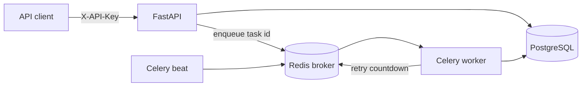

# Taskflow Orchestrator

[Русская версия](README.ru.md)

Production-style FastAPI backend for reliable async task orchestration. The MVP exposes an API for creating durable `summarize_text` and `video_draft` jobs, executes them in Celery workers, persists status/result/history in PostgreSQL, and uses Redis for broker/locks.

## Why This Project Matters

This project demonstrates backend skills that matter in real systems: API design, durable state transitions, idempotency, background execution, retry/backoff, dead-letter handling, Dockerized infrastructure, and testable service boundaries.

## Architecture



PostgreSQL is the source of truth for task status, results, errors, and attempt history. Redis is runtime infrastructure only: Celery broker plus short-lived task locks.

## Quick Start

```bash
cp .env.example .env
docker compose up --build
```

In another terminal, create a demo API key:

```bash
docker compose exec api python -m app.cli create-api-key --name demo
```

Use the printed key:

```bash
API_KEY="tf_..."

curl -X POST http://localhost:8000/tasks \
  -H "Content-Type: application/json" \
  -H "X-API-Key: $API_KEY" \
  -H "Idempotency-Key: article-001" \
  -d '{"type":"summarize_text","payload":{"text":"Taskflow turns slow work into reliable background jobs with retries."},"max_retries":3}'
```

Create a video draft task for the `VIDEO_PRODUCER` path:

```bash
curl -X POST http://localhost:8000/tasks \
  -H "Content-Type: application/json" \
  -H "X-API-Key: $API_KEY" \
  -H "Idempotency-Key: video-001" \
  -d '{"type":"video_draft","payload":{"source":"telegram","telegram":{"chat_id":"42","user_id":"7"},"brief":{"topic":"ai-video-factory portfolio","audience":"portfolio reviewers","cta":"subscribe","language":"en","target_platform":"youtube_shorts","duration_sec":60,"tone":"expert, practical","format":"9:16","review_required":true},"discussion":{"steps":[]},"tool":{"agent_role":"VIDEO_PRODUCER","adapter":"ai-video-factory"}},"max_retries":3}'
```

Check status:

```bash
curl http://localhost:8000/tasks/{task_id} -H "X-API-Key: $API_KEY"
```

Or run the end-to-end smoke test after the stack is up:

```bash
make smoke
```

## API

- `GET /health` - process health.
- `GET /ready` - database readiness check.
- `GET /metrics` - Prometheus-style operational metrics.
- `POST /tasks` - create a task and enqueue it.
- `GET /tasks/{id}` - get status, result, error, and attempts.
- `GET /tasks?status=queued&limit=20&offset=0` - list tasks.
- `POST /tasks/{id}/cancel` - cancel `queued` or `retrying` tasks.
- `POST /tasks/{id}/replay` - move a `dead_letter` task back to `queued`.

All `/tasks` endpoints require `X-API-Key`. `POST /tasks` supports `Idempotency-Key` to make retries safe.

## Observability

`GET /metrics` returns aggregate Prometheus text metrics from PostgreSQL:

- `taskflow_tasks_total{type,status}` - current task counts.
- `taskflow_task_attempts_total{type,status}` - task attempt counts.
- `taskflow_task_attempt_duration_ms_avg{type}` - average finished attempt duration.
- `taskflow_task_queue_latency_ms_avg{type}` - average time from task creation to first worker attempt.

Metrics are aggregate-only and do not expose task payloads, user identifiers, or error details.

## State Machine

```text
queued -> running -> succeeded
queued -> running -> retrying -> running
queued -> running -> failed
queued -> running -> dead_letter
queued/retrying -> cancelled
dead_letter -> queued
```

Retryable mock failures are triggered by including `__retry__` in summarize text. Non-retryable mock failures are triggered by `__fail__`. For `video_draft`, the worker calls `VIDEO_FACTORY_WEBHOOK_URL`; network/5xx failures are retryable, while malformed responses fail with a sanitized error.

## Local Development

```bash
uv sync
uv run pytest
uv run ruff check .
```

The same workflow is available through Make:

```bash
make install
make check
```

Run only the API locally:

```bash
uv run uvicorn app.main:app --reload
```

Run migrations:

```bash
uv run alembic upgrade head
```

Run a worker:

```bash
uv run celery -A app.workers.celery_app.celery_app worker --loglevel=info
```

## Design Trade-offs

- Real LLM integration is intentionally out of scope for v1. The summarization and video-factory adapters are isolated so OpenAI/local model/media providers can be added behind stable task contracts later.
- Tests use SQLite for fast service/API coverage; Docker Compose is the integration path for PostgreSQL, Redis, Celery, and migrations.
- Celery result backend is not the business source of truth. Clients read status and results from PostgreSQL.

See [Architecture Notes](docs/ARCHITECTURE.md) for the boundary decisions, failure modes, and extension points.

## Next Steps

- Add OpenTelemetry traces.
- Add PostgreSQL-backed scheduled jobs beyond retry countdowns.
- Add admin endpoints for dead-letter replay.
- Add a real LLM summarization adapter behind the existing interface.
