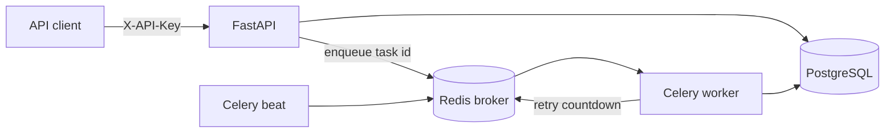

# Taskflow Orchestrator

[English version](README.md)

Production-style backend на FastAPI для надежной оркестрации асинхронных задач. MVP позволяет создавать задачи `summarize_text` через REST API, выполнять их в Celery workers, хранить статус/результат/историю попыток в PostgreSQL и использовать Redis как broker и механизм runtime locks.

## Почему Этот Проект Важен

Проект показывает backend-навыки, которые важны в реальных production-системах: дизайн API, надежные state transitions, idempotency, фоновое выполнение, retry/backoff, dead-letter handling, Docker-инфраструктура и тестируемые service boundaries.

## Архитектура



PostgreSQL является source of truth для статусов задач, результатов, ошибок и истории попыток. Redis используется только как runtime-инфраструктура: Celery broker и короткоживущие locks для задач.

## Быстрый Старт

```bash
cp .env.example .env
docker compose up --build
```

В другом терминале создайте demo API key:

```bash
docker compose exec api python -m app.cli create-api-key --name demo
```

Используйте выведенный ключ:

```bash
API_KEY="tf_..."

curl -X POST http://localhost:8000/tasks \
  -H "Content-Type: application/json" \
  -H "X-API-Key: $API_KEY" \
  -H "Idempotency-Key: article-001" \
  -d '{"type":"summarize_text","payload":{"text":"Taskflow turns slow work into reliable background jobs with retries."},"max_retries":3}'
```

Проверить статус:

```bash
curl http://localhost:8000/tasks/{task_id} -H "X-API-Key: $API_KEY"
```

Или запустить end-to-end smoke test после старта Docker Compose:

```bash
make smoke
```

## API

- `GET /health` - проверка, что процесс жив.
- `GET /ready` - readiness check с проверкой соединения с БД.
- `POST /tasks` - создать задачу и поставить ее в очередь.
- `GET /tasks/{id}` - получить статус, результат, ошибку и историю попыток.
- `GET /tasks?status=queued&limit=20&offset=0` - список задач с фильтрацией и пагинацией.
- `POST /tasks/{id}/cancel` - отменить задачу в статусе `queued` или `retrying`.

Все `/tasks` endpoints требуют `X-API-Key`. `POST /tasks` поддерживает `Idempotency-Key`, чтобы безопасно повторять запросы на создание задачи.

## State Machine

```text
queued -> running -> succeeded
queued -> running -> retrying -> running
queued -> running -> failed
queued -> running -> dead_letter
queued/retrying -> cancelled
```

Retryable mock failure можно вызвать, добавив `__retry__` в текст. Non-retryable mock failure можно вызвать через `__fail__`.

## Локальная Разработка

```bash
uv sync
uv run pytest
uv run ruff check .
```

То же самое через Make:

```bash
make install
make check
```

Запустить только API локально:

```bash
uv run uvicorn app.main:app --reload
```

Применить миграции:

```bash
uv run alembic upgrade head
```

Запустить worker:

```bash
uv run celery -A app.workers.celery_app.celery_app worker --loglevel=info
```

## Архитектурные Trade-offs

- Реальная LLM-интеграция намеренно не входит в v1. Summarization adapter изолирован, поэтому позже можно добавить OpenAI или локальную модель.
- Тесты используют SQLite для быстрых service/API проверок; Docker Compose остается путем для интеграционной проверки PostgreSQL, Redis, Celery и миграций.
- Celery result backend не является бизнесовым source of truth. Клиенты читают статус и результат из PostgreSQL.

Подробнее: [Architecture Notes](docs/ARCHITECTURE.md) с boundary decisions, failure modes и extension points.

## Следующие Шаги

- Добавить OpenTelemetry traces и Prometheus metrics.
- Добавить PostgreSQL-backed scheduled jobs помимо retry countdowns.
- Добавить admin endpoints для replay задач из `dead_letter`.
- Добавить реальный LLM summarization adapter за существующим интерфейсом.
