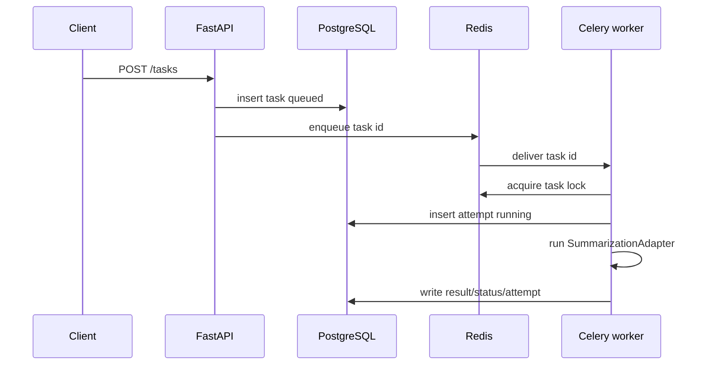

# Architecture Notes

Taskflow Orchestrator is intentionally small, but it is shaped like a production backend: API contracts stay separate from business logic, durable state lives in PostgreSQL, and workers are allowed to fail without losing task history.

## Core Flow

1. A client calls `POST /tasks` with `X-API-Key` and optional `Idempotency-Key`.
2. FastAPI validates the request and the service layer creates a `queued` task row.
3. The API enqueues only the task id into Celery.
4. A worker acquires a Redis lock for that task id, writes a `running` attempt, and executes the adapter.
5. The worker writes the terminal result or schedules a retry with exponential backoff.

## Boundaries

- `app/api` owns HTTP contracts, request validation, auth dependencies, and error shape.
- `app/services` owns state transitions, retry policy, and adapter-facing business logic.
- `app/db` owns ORM models, sessions, and query/repository mechanics.
- `app/workers` owns Celery registration, Redis locking, and worker process entrypoints.

The worker does not trust Celery result storage as durable business state. Celery can report delivery/execution metadata, but clients read task status from PostgreSQL.

## Failure Modes

- Duplicate create requests are handled with `Idempotency-Key`.
- Duplicate worker delivery is guarded by a short-lived Redis lock plus terminal-state checks.
- Retryable adapter errors move the task to `retrying` and schedule another Celery execution.
- Exhausted retry budget moves the task to `dead_letter`.
- Dead-letter tasks can be replayed explicitly, which resets runtime fields and enqueues the same task id again.
- Non-retryable adapter or payload errors move the task to `failed`.
- Completed, failed, dead-lettered, and cancelled tasks are not re-executed by the service layer.

## Observability

- `/metrics` exposes Prometheus-style text metrics computed from PostgreSQL.
- Task metrics are labeled by `type` and `status` to make stuck queues, failed job classes, and dead-letter buildup visible.
- Attempt duration and queue latency metrics are aggregate-only and avoid payload, user, and error-detail leakage.

## Intentional Trade-offs

- SQLite is used for fast local unit/API tests; PostgreSQL is used by Docker Compose and migrations.
- The MVP includes one typed job, `summarize_text`, instead of a generic plugin registry.
- The summarization adapter is mocked to keep secrets and paid APIs out of the core demo.
- Celery Beat is included in Compose for infrastructure realism, but retry scheduling uses Celery countdowns in v1.

## Extension Points

- Add an OpenAI or local-model summarization adapter behind `SummarizationAdapter`.
- Add role-based admin controls around `dead_letter` replay.
- Add OpenTelemetry traces connecting API task creation to worker execution.
